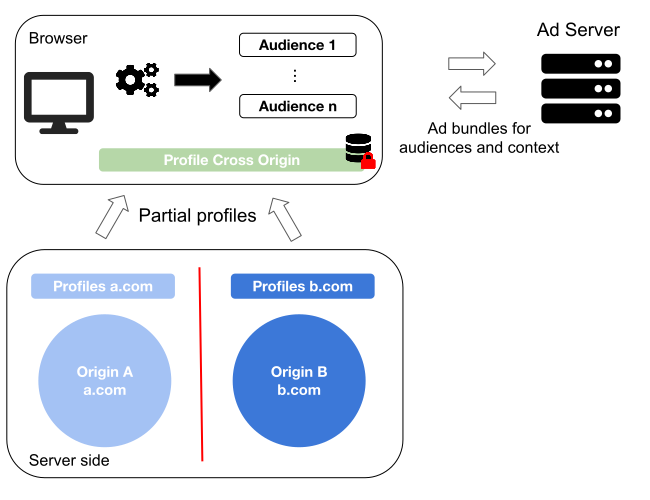
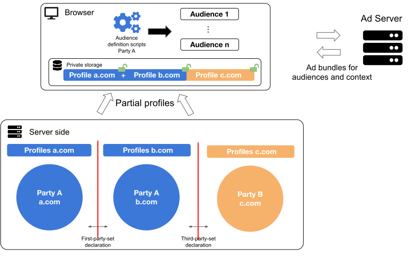

# Generalization of Turtledove and First-party sets

We propose to generalize [Turtledove](https://github.com/WICG/turtledove) and [First-party sets](https://github.com/privacycg/first-party-sets) to enable full profile based targeting while remaining compliant with the chromium privacy model. More precisely, the goal is to be able to target users based on deterministic behavioral data collected in the browser and across domains and/or parties while preserving privacy.

## The capabilities of Turtledove
In a nutshell, the Turtledove framework consists of the following steps to show a targeted ad:
* Interests groups (aka audiences or segments) are computed based on first-party data only (from one domain).
These interest groups are collected in the browser. Only the browser has a *cross-domain* overview on the interest groups a user belongs to.
* The browser retrieves ad bundles (implemented as web bundles) from ad servers using two types of requests that are kept uncorrelated (for privacy reasons). One request type retrieves bundles for the context of the page (contextual targeting). The other request type retrieves an ad bundle for the collected interests groups. Each bundle also includes a bid.
* An in-browser auction occurs to select the ad to show.

From our perspective, the Turtledove approach is well suited to target users for the following types of targeting:
* Contextual targeting. This is simply achieved by using a contextual request as described in the explainer.
* Intent based targeting (based on specific user actions) using an interest group like "hit-paywall-twice". This also includes re-targeting using an interest group like "looked-at-shoes-xyz".
* Limited profile based targeting. Interest groups can be used to profile users using data observed on one domain only. As described in the explainer, this could be achieved using an interest group like "athletic-shoes". This proposal aims at alleviating the per-domain restriction of interest groups.

Since interest groups can be computed using data of only one domain, the semantics of these groups are necessarily related/constrained to the activity on a domain or its content. In other words, interest groups are not well suited to model user properties that can only be computed using behavioral cross-domain data. For example, estimating if a user is male or female cannot simply be computed using data from "wereallylikeshoes.com": the group will be biased toward women and there is no way to compensate the bias by using data collected on other domains.

# Generalization in a nutshell

We propose to introduce in the browser a "sandboxed private storage" that has limited read capabilities. The role of the storage is to keep a profile that consists of data collected *across domains*. Then, only pre-registered scripts with a constrained signature are allowed to read this data and to output interest groups. No other read/write capabilities are allowed for these scripts. The rest remains identical to Turtledove. In the following, we use the term "audience" instead of "interest group" to better reflect the increased targeting capabilities. The pre-registered script is called an audience definition script.

The following diagram gives an overview of the proposal.

<p align="center">
  
</p>

The difference to Turtledove is that partial profiles (i.e. profiles of one domain) are stored in the browser, not audiences (interest groups). The Turtledove bidding process that is used to select an ad is not affected by this proposal.

Next, we discuss how the browser controls the access to partial profiles.

## Access to the private storage

As depicted in the diagram, the audience definition script always has access to the partial profiles that originates from the same party (the audience definition was registered on a domain of that party). Which domains belong to the same party are defined by the server side first-party-set declaration which is known to the browser as described in the [proposal](https://github.com/privacycg/first-party-sets#declaring-a-first-party-set).

As explained so far, it is possible to perform targeting based on client-side first-party profiles. This is similar to the scenario where First-part-sets and Turtledove are implemented simultaneously with the exception that the profile is server sided (assuming first-party-sets are used to implement [cross-domain first-party cookies](https://www.chromestatus.com/feature/5640066519007232)).

To increase data sharing capabilities, we propose to naturally extend the first-party-set proposal to also support third-party declarations. The server `c.com` would serve the following resource:

```
https://c.com/.well-known/third-party-set
{ "owner": "a.com" }
```

As with first-party sets, the browser would be aware of the relationship between parties. This would it possible to grant the appropriate reading permissions to audience definition scripts to also access third-party data.

<p align="center">
  
</p>

In the following, we briefly show how to programmatically use the private storage to perform targeting based on a cross-domain profile.

## API Example Flow

We describe an illustrative scenario where a cross-domain profile is built in the browser as a user anonymously navigates the web, i.e., without using a login.

As I anonymously browse "weReallyLoveShopping.com" my behavior reveals that I am interested in athletic shoes. The online shop writes this information in the private storage:

```javascript
window.privateStorage.setItem('interests', 'athletic-shoes');
```

I also regularly and anonymously visit the publisher "myLocalNewspaper.com". The domain is not owned by the same party as "weReallyLoveShopping.com" but the latter is declared as a third-party of the former. Based on the pages I read, the publisher estimates a probability of 0.3% that I am a female and writes this to the private storage:

```javascript
window.privateStorage.setItem('femaleProb', 0.3);
```

Note that `privateStorage` does not provide reading capabilities at this point (i.e. the method `privateStorage.getItem` is not accessible).

In addition, domains always have the possibility to register audience definition scripts. In our example, the publisher registers an audience definition script as follows:

```javascript
const maleAthleticShoes =
  {'name': 'femaleAthleticShoesAudience',
   'readers': ['first-ad-network.com',
               'second-ad-network.com'],
    'script': "\
    	return privateStorage.getItem('femaleProb') < 0.5 && \
             privateStorage.getItem('interests' == 'athletic-shoes')"
  };
window.privateStorage.addAudienceDefinition(maleAthleticShoes);
```

The audience definition scripts must return a boolean value to indicate audience membership and are evaluated before fetching the ad bundles. In this example, the script needs to access data that originates from two domains. But because of the declared third-party relationship and because the script is running in a sandboxed environment, both `getItem` calls return a value. Since audience definition scripts are only allowed to determine audience membership, no private information can leak from the private storage.

The rest of the API flow remains identical Turtledove; the browser then contacts `first-ad-network.com` and requests ads targeted at this audience:

```bash
curl -X GET https://first-ad-network.com/.well-known/fetch-ads?audience=femaleAthleticShoesAudience
```

See the [Turtledove](https://github.com/WICG/turtledove) for the rest of the flow.


## Privacy

The following design aspects shall guarantee that the browser does not leak private information:

* Audiences can be defined freely by advertisers. However, as with Turtledove, browsers should devise an infrastructure to deactivate audiences that have too few users. This is to prevent micro-targeting which essentially makes tracking possible again.

* The proposed private storage shall be accessed by one advertiser only to prevent malicious actors from corrupting profiles (and affecting the advertisers business). In the paragraph [API Example Flow](#api-example-flow), the storage is accessed using an advertiser ID. This needs to be improved and an authentication mechanism must be devised to control the access to the storage.

* Only audience definition scripts are allowed to read the content of the storage (for example, one could imagine a separate javascript runtime per storage). The script is only allowed to return booleans which guarantees that no private data can leak.

## UI controls

In addition to the browser UI controls of Turtledove, this approach would enable the following additional controls:
* The browser could provide a mean to see the profile data that is collected by a given advertiser. GDPR/CCPA access requests could simply amount to reading this storage using a UI control in the browser (provided the profile contains all the data collected by the advertiser).
* The audience definition scripts could also be inspected by the user. This has the advantage that users have a mean to understand *how* they got attributed to an audience. Maybe this could be useful to discover problematic targeting practices (for example political targeting campaigns). On the other hand, we believe that advertisers have the right to keep their targeting technologies proprietary. However, this could be constrained to the partial profiles that are computed from one domain only (from first-party data, where the heavy lifting is happening).
* The user shall be able to delete audience memberships using a UI control. This can be achieved by removing/blocking the audience definitions. In addition, advertisers can also remove audience definitions using a method `privateStorage.removeAudienceDefinition` (this is similar to Turtledove).
* The user shall be able to delete/block the private storage for an advertiser that he/she does not trust.

## Compatibility with other proposals

This proposal generalizes Turtledove and does not conflict with the other main proposals such as [SPARROW](https://github.com/WICG/sparrow) (bidding) and the [Aggregated Reporting API](https://github.com/csharrison/aggregate-reporting-api) (that could also be used for [lookalike targeting](https://github.com/w3c/web-advertising/blob/master/privacy_preserving_lookalike_audience_targeting.md)).
